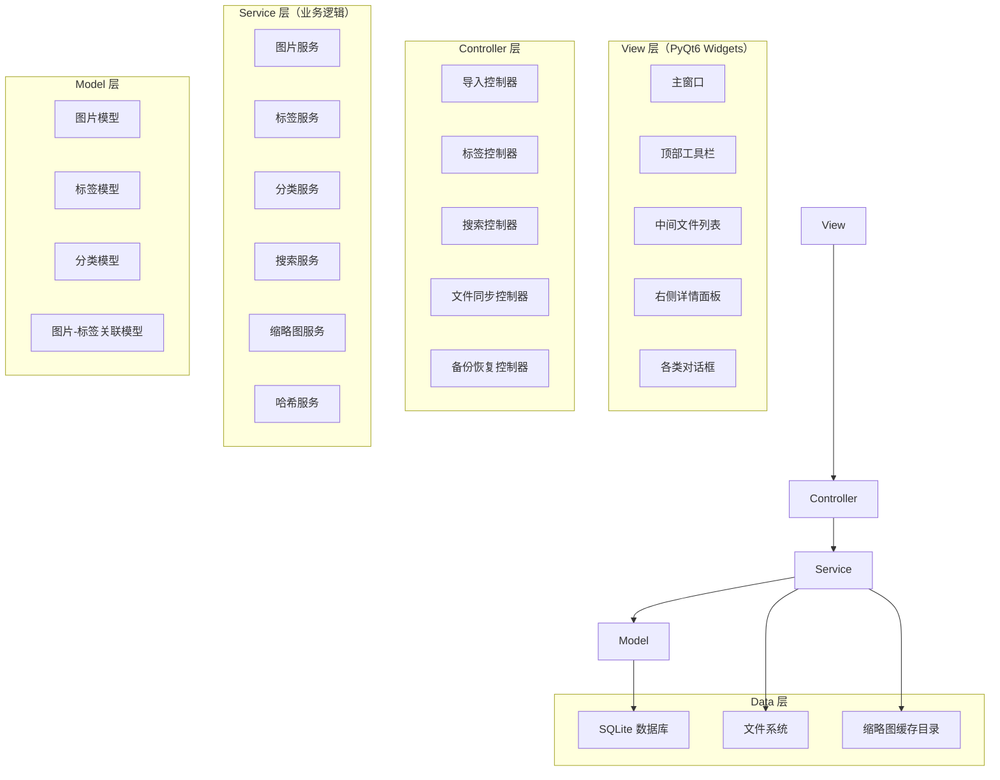
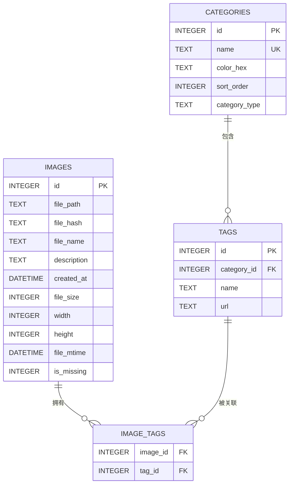
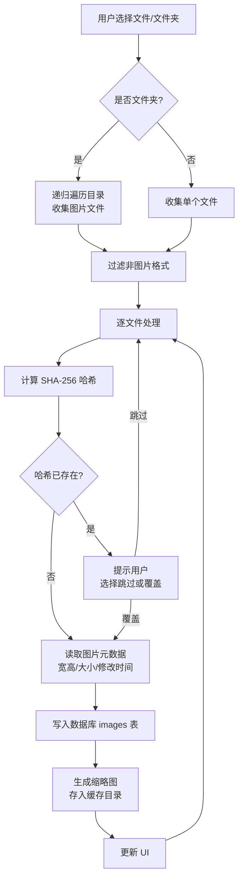
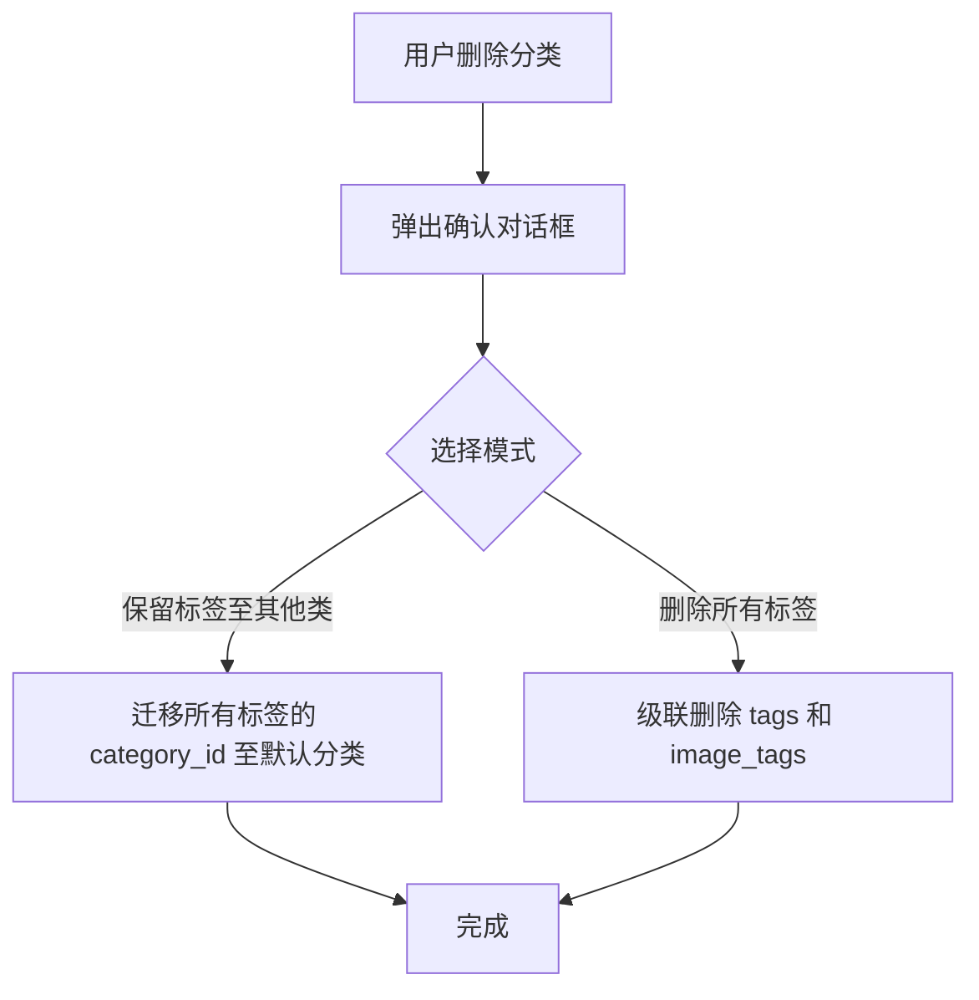
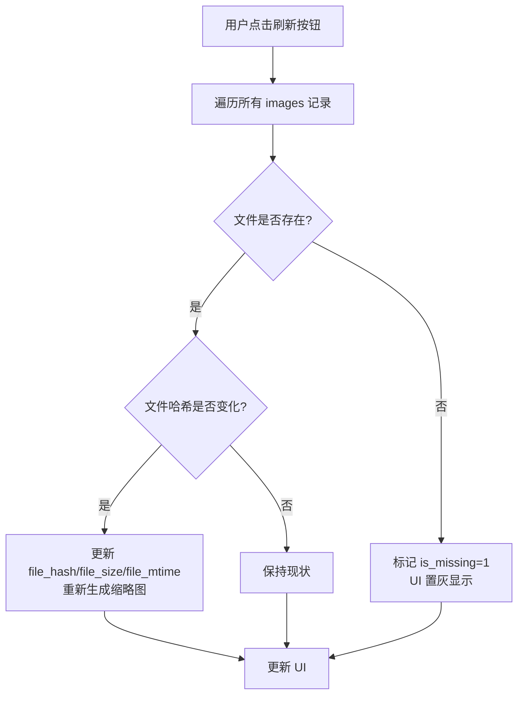
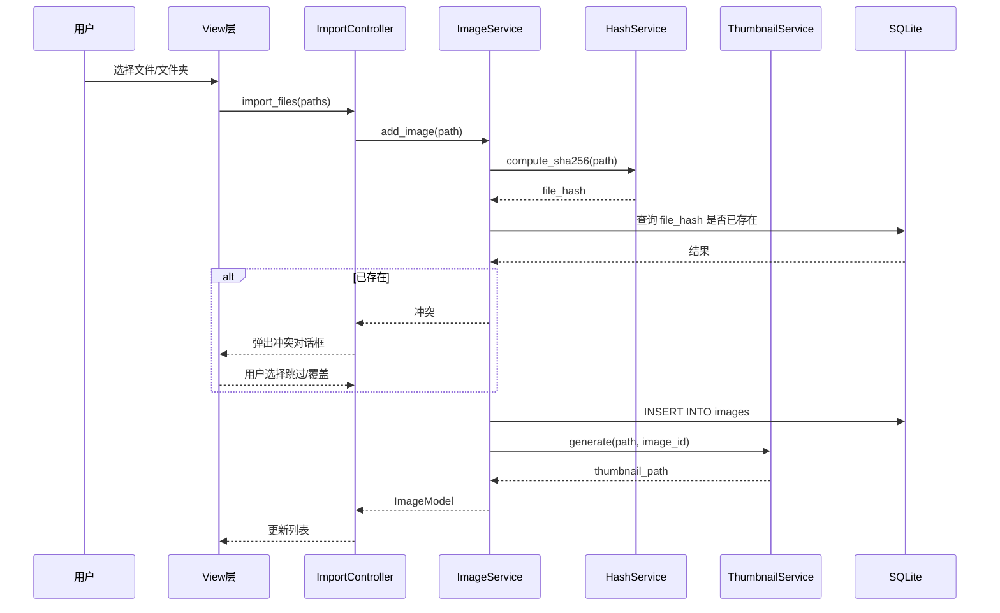
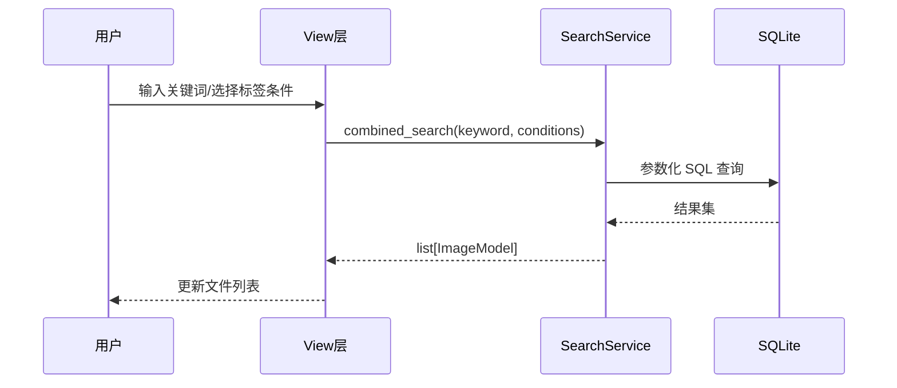

# 图片标签管理器（Pic Tagger）设计文档

> 版本：v1.0  
> 日期：2026-08-15  
> 状态：设计定稿  
> 关联文档：[PRD](./prd.md)

---

## 目录

1. [总体架构设计](#1-总体架构设计)
2. [技术选型](#2-技术选型)
3. [数据库详细设计](#3-数据库详细设计)
4. [模块详细设计](#4-模块详细设计)
5. [UI 与交互设计](#5-ui-与交互设计)
6. [接口与数据流设计](#6-接口与数据流设计)
7. [异常与边界处理](#7-异常与边界处理)
8. [非功能需求设计](#8-非功能需求设计)
9. [测试设计](#9-测试设计)
10. [项目目录结构](#10-项目目录结构)
11. [里程碑与迭代计划](#11-里程碑与迭代计划)

---

## 1. 总体架构设计

### 1.1 架构风格

采用 **MVC（Model-View-Controller）** 分层架构，将数据层、业务逻辑层与界面层解耦，便于后续扩展与维护。



### 1.2 分层职责说明

| 层 | 职责 | 关键约束 |
| :--- | :--- | :--- |
| **View 层** | 界面渲染、用户输入捕获、事件转发 | 不直接访问数据库，只通过 Controller 交互 |
| **Controller 层** | 接收 View 事件，编排 Service 调用，更新 View | 不包含业务逻辑，只做调度与状态管理 |
| **Service 层** | 核心业务逻辑（导入、标签、搜索、同步等） | 可独立单元测试，不依赖 UI |
| **Model 层** | 数据实体定义与 ORM 映射 | 与数据库表一一对应 |
| **Data 层** | SQLite 持久化、文件系统访问、缓存管理 | 数据全部保存在程序文件夹内 |

### 1.3 关键设计决策

| 决策点 | 选择 | 理由 |
| :--- | :--- | :--- |
| GUI 框架 | PyQt6 | 跨平台、控件丰富、支持表格/缩略图/拖拽等复杂交互 |
| 数据库 | SQLite（内置 `sqlite3`） | 零配置、单文件、满足本地单机需求 |
| 缩略图缓存 | 程序目录下 `cache/thumbnails/` | 避免污染系统目录，符合"绿色"要求 |
| 图片处理 | Pillow（PIL） | 轻量、支持主流格式、可生成缩略图 |
| 文件哈希 | SHA-256 | 碰撞概率极低，用于去重 |
| 线程模型 | 主线程 + 工作线程（`QThread`） | 导入/缩略图生成等耗时操作不阻塞 UI |

---

## 2. 技术选型

### 2.1 依赖清单

| 依赖 | 版本 | 用途 |
| :--- | :--- | :--- |
| `PyQt6` | ≥ 6.5 | GUI 框架 |
| `Pillow` | ≥ 10.0 | 图片读取、缩略图生成 |
| `sqlite3` | 内置 | 数据库访问 |
| `hashlib` | 内置 | 文件哈希计算 |
| `pathlib` | 内置 | 路径处理 |
| `threading` | 内置 | 多线程支持 |

### 2.2 运行环境

- Python ≥ 3.10
- 操作系统：Windows / macOS / Linux（跨平台）
- 无网络依赖，纯本地运行

---

## 3. 数据库详细设计

### 3.1 ER 图



### 3.2 表结构定义

#### 3.2.1 `categories`（标签分类表）

| 字段名 | 类型 | 约束 | 说明 |
| :--- | :--- | :--- | :--- |
| `id` | INTEGER | PK，自增 | 分类唯一 ID |
| `name` | TEXT | NOT NULL, UNIQUE | 分类显示名（如"作者"、"原作品"） |
| `color_hex` | TEXT | - | 分类颜色代码（如 `#4A90D9`） |
| `sort_order` | INTEGER | - | 侧边栏/面板显示排序权重 |
| `category_type` | TEXT | NOT NULL, DEFAULT 'free' | 分类类型：`free`（自由输入）/ `option`（选项式）/ `unique`（唯一式） |

**索引**：`categories(name)`（唯一索引）

#### 3.2.2 `tags`（标签表）

| 字段名 | 类型 | 约束 | 说明 |
| :--- | :--- | :--- | :--- |
| `id` | INTEGER | PK，自增 | 标签唯一 ID |
| `category_id` | INTEGER | FK → `categories.id`，NOT NULL | 所属分类 |
| `name` | TEXT | NOT NULL | 标签短字符串（如"米山舞"） |
| `url` | TEXT | - | 可选超链接（P4 功能预留） |

**索引**：`tags(category_id, name)`（**复合唯一索引**，保证同分类下标签不重名）

#### 3.2.3 `images`（图片表）

| 字段名 | 类型 | 约束 | 说明 |
| :--- | :--- | :--- | :--- |
| `id` | INTEGER | PK，自增 | 图片唯一 ID |
| `file_path` | TEXT | NOT NULL | 绝对路径 |
| `file_hash` | TEXT | NOT NULL, Indexed | 文件指纹（SHA-256） |
| `file_name` | TEXT | - | 原始文件名（冗余，便于快速显示） |
| `description` | TEXT | - | 长文本描述 |
| `created_at` | DATETIME | - | 导入时间 |
| `file_size` | INTEGER | - | 文件大小（字节） |
| `width` | INTEGER | - | 图片宽度（像素） |
| `height` | INTEGER | - | 图片高度（像素） |
| `file_mtime` | DATETIME | - | 文件最后修改时间 |
| `is_missing` | INTEGER | NOT NULL, DEFAULT 0 | 文件是否丢失（0=正常，1=丢失） |

**索引**：`images(file_hash)`（普通索引）

#### 3.2.4 `image_tags`（图片-标签关联表）

| 字段名 | 类型 | 约束 | 说明 |
| :--- | :--- | :--- | :--- |
| `image_id` | INTEGER | FK → `images.id` | 图片 ID |
| `tag_id` | INTEGER | FK → `tags.id` | 标签 ID |

**索引**：`image_tags(image_id, tag_id)`（复合索引，加速关联查询）

**约束**：`PRIMARY KEY (image_id, tag_id)`，保证同一图片同一标签不重复。

### 3.3 建表 SQL

```sql
-- 标签分类表
CREATE TABLE IF NOT EXISTS categories (
    id            INTEGER PRIMARY KEY AUTOINCREMENT,
    name          TEXT    NOT NULL UNIQUE,
    color_hex     TEXT,
    sort_order    INTEGER DEFAULT 0,
    category_type TEXT    NOT NULL DEFAULT 'free'
);

-- 标签表
CREATE TABLE IF NOT EXISTS tags (
    id          INTEGER PRIMARY KEY AUTOINCREMENT,
    category_id INTEGER NOT NULL,
    name        TEXT    NOT NULL,
    url         TEXT,
    FOREIGN KEY (category_id) REFERENCES categories(id) ON DELETE CASCADE,
    UNIQUE (category_id, name)
);

-- 图片表
CREATE TABLE IF NOT EXISTS images (
    id          INTEGER PRIMARY KEY AUTOINCREMENT,
    file_path   TEXT    NOT NULL,
    file_hash   TEXT    NOT NULL,
    file_name   TEXT,
    description TEXT,
    created_at  DATETIME DEFAULT CURRENT_TIMESTAMP,
    file_size   INTEGER,
    width       INTEGER,
    height      INTEGER,
    file_mtime  DATETIME,
    is_missing  INTEGER NOT NULL DEFAULT 0
);

-- 图片-标签关联表
CREATE TABLE IF NOT EXISTS image_tags (
    image_id INTEGER NOT NULL,
    tag_id   INTEGER NOT NULL,
    PRIMARY KEY (image_id, tag_id),
    FOREIGN KEY (image_id) REFERENCES images(id) ON DELETE CASCADE,
    FOREIGN KEY (tag_id)   REFERENCES tags(id)   ON DELETE CASCADE
);

-- 索引
CREATE UNIQUE INDEX IF NOT EXISTS idx_categories_name ON categories(name);
CREATE UNIQUE INDEX IF NOT EXISTS idx_tags_category_name ON tags(category_id, name);
CREATE INDEX IF NOT EXISTS idx_image_tags ON image_tags(image_id, tag_id);
CREATE INDEX IF NOT EXISTS idx_images_hash ON images(file_hash);
```

### 3.4 数据字典补充说明

- **默认分类**：数据库初始化（`create_tables`）时自动创建名为 **"未分类"** 的分类（`INSERT OR IGNORE`，幂等），并**显式指定固定 id = 1**。该分类**不允许删除或重命名**，作为删除其他分类时 `move_to_default` 模式的标签落点。**通过固定 id 识别默认分类**（而非名称），因此即使名称被改动，默认分类身份依然稳定。
- **`category_type` 字段**：为 P3 的"选项式标签类"和"唯一式标签类"预留。`free` 为默认自由输入模式。
- **`tags.url` 字段**：为 P4 的"标签超链接"功能预留。
- **`images.is_missing` 字段**：用于文件丢失标记，避免每次启动都全量扫描文件系统。
- **`images.width/height`**：冗余存储图片尺寸，避免详情面板每次读取原图。

---

## 4. 模块详细设计

### 4.1 图片导入模块

#### 4.1.1 功能流程



#### 4.1.2 类设计

```python
class ImportController:
    """导入控制器：协调导入流程"""
    def import_files(self, paths: list[str]) -> ImportResult: ...
    def import_folder(self, folder_path: str) -> ImportResult: ...
    def remove_index(self, image_ids: list[int], delete_file: bool = False) -> None: ...

class ImageService:
    """图片服务：核心业务逻辑"""
    def add_image(self, path: str) -> ImageModel | None: ...
    def get_image_by_hash(self, file_hash: str) -> ImageModel | None: ...
    def remove_image(self, image_id: int, delete_file: bool = False) -> None: ...
    def get_all_images(self) -> list[ImageModel]: ...

class HashService:
    """哈希服务：计算文件指纹"""
    def compute_sha256(self, file_path: str) -> str: ...

class ThumbnailService:
    """缩略图服务：生成与管理缩略图"""
    THUMB_SIZE = (200, 200)
    def generate(self, image_path: str, image_id: int) -> str: ...
    def get_thumbnail_path(self, image_id: int) -> str: ...
    def clear_cache(self) -> None: ...
```

#### 4.1.3 关键实现细节

- **批量导入**：使用 `QThread` 后台线程处理，避免阻塞 UI。通过信号（Signal）逐张更新进度。
- **去重策略**：计算文件 SHA-256 哈希，与 `images.file_hash` 比对。重复时弹出对话框让用户选择"跳过"或"覆盖"。
- **缩略图生成**：使用 Pillow 的 `Image.thumbnail()` 方法，保持宽高比，最大边 200px。缓存文件命名为 `{image_id}.jpg`。
- **不可用图片**：若 Pillow 无法解析（如损坏文件），使用默认占位缩略图，不影响标签功能。

### 4.2 标签分类模块

#### 4.2.1 分类类型

| 类型 | 枚举值 | 说明 | 交互约束 |
| :--- | :--- | :--- | :--- |
| 自由式 | `free` | 默认，可自由输入新标签 | 输入时自动补全已有标签 |
| 选项式 | `option` | 只能从已有标签中选择 | 禁止自定义输入，下拉选择 |
| 唯一式 | `unique` | 每张图片该分类下只能有一个标签 | 添加新标签时替换旧标签 |

#### 4.2.2 类设计

```python
class CategoryService:
    """分类服务"""
    def create_category(self, name: str, category_type: str = 'free') -> CategoryModel: ...
    def rename_category(self, category_id: int, new_name: str) -> None: ...
    def delete_category(self, category_id: int, mode: str) -> None:
        """mode: 'move_to_default' 或 'delete_all'；默认分类不可删除"""
    def set_color(self, category_id: int, color_hex: str) -> None: ...
    def get_all_categories(self) -> list[CategoryModel]: ...

class TagService:
    """标签服务"""
    def add_tag(self, category_id: int, name: str) -> TagModel: ...
    def rename_tag(self, tag_id: int, new_name: str) -> None: ...
    def delete_tag(self, tag_id: int) -> None: ...
    def get_tags_by_category(self, category_id: int) -> list[TagModel]: ...
    def autocomplete(self, category_id: int, prefix: str) -> list[str]: ...
    def set_tag_url(self, tag_id: int, url: str) -> None: ...
```

#### 4.2.3 删除分类的两种模式

> **默认分类（"未分类"）不可删除、不可重命名**，始终作为 `move_to_default` 模式的标签落点。



### 4.3 图片-标签关联模块

#### 4.3.1 类设计

```python
class ImageTagService:
    """图片-标签关联服务"""
    def add_tag_to_image(self, image_id: int, tag_id: int) -> None: ...
    def remove_tag_from_image(self, image_id: int, tag_id: int) -> None: ...
    def get_tags_for_image(self, image_id: int) -> list[TagModel]: ...
    def get_images_for_tag(self, tag_id: int) -> list[ImageModel]: ...
    def batch_add_tag(self, image_ids: list[int], tag_id: int) -> None: ...
    def batch_remove_tag(self, image_ids: list[int], tag_id: int) -> None: ...
    def get_image_tags_grouped(self, image_id: int) -> dict[int, list[TagModel]]:
        """按分类分组返回图片的标签"""
```

#### 4.3.2 批量操作

- 多选图片后，右侧面板进入"批量编辑模式"。
- 添加/移除标签操作通过 `batch_add_tag` / `batch_remove_tag` 一次性作用于所有选中图片。
- 使用事务（Transaction）保证批量操作的原子性。

### 4.4 搜索模块

#### 4.4.1 搜索类型

| 搜索类型 | 说明 | SQL 实现 |
| :--- | :--- | :--- |
| **全局关键词** | 在文件名、标签名中模糊匹配 | `WHERE file_name LIKE ? OR EXISTS (SELECT 1 FROM image_tags it JOIN tags t ON it.tag_id=t.id WHERE it.image_id=images.id AND t.name LIKE ?)` |
| **分类筛选** | 在指定分类下按标签筛选 | `WHERE EXISTS (SELECT 1 FROM image_tags it JOIN tags t ON it.tag_id=t.id WHERE it.image_id=images.id AND t.category_id=? AND t.name=?)` |
| **交集（AND）** | 同时满足多个标签条件 | 多个 `EXISTS` 子句用 `AND` 连接 |
| **并集（OR）** | 满足任一标签条件 | 多个 `EXISTS` 子句用 `OR` 连接 |

#### 4.4.2 类设计

```python
class SearchService:
    """搜索服务"""
    def search_by_keyword(self, keyword: str) -> list[ImageModel]: ...
    def search_by_tags(self, conditions: list[TagCondition], logic: str = 'AND') -> list[ImageModel]: ...
    def combined_search(self, keyword: str, tag_conditions: list[TagCondition], logic: str = 'AND') -> list[ImageModel]: ...

@dataclass
class TagCondition:
    category_id: int
    tag_name: str
```

#### 4.4.3 性能优化

- 所有搜索查询使用**参数化 SQL**，防止 SQL 注入。
- 利用 `image_tags` 复合索引加速关联查询。
- 1000 张图片规模下，索引查询可保证 < 500ms 响应。

### 4.5 文件索引有效性保证模块

#### 4.5.1 刷新流程



#### 4.5.2 丢失文件处理

- **UI 表现**：条目置灰，文件名旁显示 ⚠ 警告图标。
- **重连选项**：右键菜单提供"重新连接文件"，弹出文件选择框，用户选择新路径后更新 `file_path` 并清除 `is_missing` 标记。
- **性能**：刷新操作在后台线程执行，避免阻塞 UI。

### 4.6 备份与恢复模块

#### 4.6.1 备份

- 将 SQLite 数据库文件复制到用户指定位置。
- 使用 SQLite 的 `VACUUM INTO` 命令生成一致性快照，避免复制过程中数据不一致。

#### 4.6.2 恢复

- 用户选择备份文件后，校验文件格式。
- 关闭当前数据库连接，替换数据库文件，重新打开。
- 恢复前自动备份当前数据库（防止误操作）。

#### 4.6.3 卸载时数据保留

- 提供"卸载前备份数据"提示。
- 数据全部保存在程序文件夹内，卸载时询问用户是否保留。

---

## 5. UI 与交互设计

### 5.1 整体布局

```
┌─────────────────────────────────────┐
│ MainWindow                          │
│  ┌───────────────────────────────┐  │
│  │ 顶部工具栏                     │  │
│  ├──────────────┬────────────────┤  │
│  │ 中间文件列表  │ 右侧详情面板    │  │
│  │ (70% 宽度)   │ (30% 宽度)      │  │
│  └──────────────┴────────────────┘  │
└─────────────────────────────────────┘
```

### 5.2 顶部工具栏

| 元素 | 说明 |
| :--- | :--- |
| **搜索框** | 全局关键词搜索，输入即搜（防抖 300ms） |
| **视图切换按钮组** | 超大图标 / 大图标 / 中图标 / 小图标 / 详细信息 / 内容列表 |
| **刷新按钮** | 触发文件索引有效性检查 |
| **导入按钮** | 下拉菜单：导入文件 / 导入文件夹 |
| **备份按钮** | 下拉菜单：备份数据库 / 恢复数据库 |

### 5.3 中间文件列表

#### 5.3.1 视图模式

| 视图 | 缩略图尺寸 | 标签展示 | 排序 |
| :--- | :--- | :--- | :--- |
| 超大图标 | 256×256 | 下方 1-2 行，`分类：标签` 格式 | 不支持列头排序 |
| 大图标 | 128×128 | 下方 1-2 行 | 不支持列头排序 |
| 中图标 | 64×64 | 右侧/下方最多 3 个核心标签 | 不支持列头排序 |
| 小图标 | 48×48 | 右侧/下方最多 3 个核心标签 | 不支持列头排序 |
| 详细信息 | 表格行 | 独立"标签"列，`[分类]：标签A、标签B` | 支持点击列头排序 |
| 内容列表 | 无缩略图 | 同详细信息 | 支持点击列头排序 |

#### 5.3.2 通用交互

| 交互 | 行为 |
| :--- | :--- |
| 单击 | 选中图片，右侧面板刷新 |
| Ctrl+单击 | 多选（逐个追加） |
| Shift+单击 | 连续区间多选 |
| Ctrl+A | 全选 |
| 右键菜单 | 删除索引、复制路径、在文件管理器中定位、重新连接文件 |
| 拖拽 | 支持拖拽文件到窗口导入 |
| 双击 | 打开原始大图预览 |

### 5.4 右侧详情面板

#### 5.4.1 单图模式

| 区块 | 内容 |
| :--- | :--- |
| **缩略图预览** | 大尺寸预览，适配面板宽度 |
| **文件基础信息** | 路径、大小、尺寸（宽×高）、修改时间、导入时间 |
| **描述编辑区** | 多行文本输入框，自动保存 |
| **标签编辑区** | 分类下拉框 + 标签输入框（自动补全）+ 已挂载标签药丸列表 |

#### 5.4.2 批量模式

- 显示"已选中 X 张图片"。
- 标签编辑区操作同时作用于所有选中图片。
- 文件基础信息区显示"多选"占位。

### 5.5 对话框设计

| 对话框 | 触发场景 | 内容 |
| :--- | :--- | :--- |
| **导入冲突** | 导入时哈希重复 | 提示重复文件，选择"跳过"或"覆盖" |
| **删除确认** | 删除图片索引 | 确认删除，附加"一并删除文件"选项（勾选后二次确认） |
| **删除分类** | 删除非空分类 | 二选一：迁移标签 / 删除所有标签 |
| **新建分类** | 创建分类 | 输入名称，选择类型（自由/选项/唯一） |
| **重命名** | 重命名分类/标签 | 输入新名称 |
| **备份** | 备份数据库 | 选择保存位置 |
| **恢复** | 恢复数据库 | 选择备份文件，确认覆盖 |

---

## 6. 接口与数据流设计

### 6.1 核心数据流

#### 6.1.1 导入数据流



#### 6.1.2 搜索数据流



### 6.2 线程模型

| 线程 | 职责 | 与 UI 交互方式 |
| :--- | :--- | :--- |
| **主线程** | UI 渲染、事件处理 | 直接操作 Widget |
| **导入线程** | 批量导入、哈希计算、缩略图生成 | 通过 Signal 发送进度/结果 |
| **刷新线程** | 文件存在性检查、哈希比对 | 通过 Signal 发送更新结果 |

### 6.3 信号（Signal）设计

```python
class ImportWorker(QThread):
    progress = pyqtSignal(int, int)          # 当前进度, 总数
    image_imported = pyqtSignal(object)      # 单张导入完成
    conflict = pyqtSignal(str, str)          # 哈希冲突 (path, hash)
    finished = pyqtSignal(ImportResult)      # 全部完成

class RefreshWorker(QThread):
    image_updated = pyqtSignal(int, bool)    # image_id, is_missing
    finished = pyqtSignal(int)               # 检查完成, 丢失数量
```

---

## 7. 异常与边界处理

| 场景 | 处理逻辑 |
| :--- | :--- |
| **同分类下创建重复标签** | 输入框变红，Tooltip 提示"该分类下已存在此标签"，禁止创建 |
| **删除非空分类** | 弹窗二选一：迁移标签至其他类 / 彻底删除 |
| **重命名分类** | 只更新 `categories.name`，UI 实时刷新 |
| **一张图同分类下过多标签（>5）** | UI 只显示前 5 个，后跟 `...+还有N个`，悬停显示全部 |
| **文件被外部删除** | 刷新后标记 `is_missing=1`，条目置灰 + ⚠ 图标 |
| **文件被外部移动** | 刷新后标记丢失，提供"重新连接文件" |
| **文件被外部修改** | 刷新后更新哈希、尺寸、缩略图 |
| **图片文件损坏/不可解析** | 使用默认占位缩略图，不影响标签功能 |
| **导入超大图片** | 缩略图生成在后台线程，不阻塞 UI |
| **数据库文件损坏** | 启动时检测，提示用户恢复备份 |
| **导入时目标文件被占用** | 捕获异常，跳过该文件并记录日志 |
| **批量操作中途失败** | 使用事务回滚，保证数据一致性 |
| **搜索无结果** | 显示空状态提示"未找到匹配的图片" |
| **唯一式分类下添加第二个标签** | 自动替换旧标签，提示用户 |

---

## 8. 非功能需求设计

### 8.1 性能设计

| 指标 | 目标 | 实现策略 |
| :--- | :--- | :--- |
| 搜索响应 | < 500ms（1000 张图） | 数据库索引 + 参数化查询 |
| 启动时间 | < 3 秒 | 懒加载缩略图，仅加载文件名列表 |
| 内存占用 | < 200MB（1000 张图） | 缩略图按需加载，不一次性载入全部原图 |
| 导入速度 | 100 张图 < 30 秒 | 后台线程 + 批量事务提交 |

### 8.2 数据安全

- 纯本地运行，无任何云端上传。
- 所有数据保存在程序文件夹内（`data.db` + `cache/`）。
- 不写注册表，不使用系统目录。

### 8.3 兼容性

- 所有文本使用 UTF-8 编码。
- 支持所有图片格式（Pillow 支持的格式）。
- 不可用图片使用默认缩略图，不影响标签功能。

### 8.4 数据目录结构

```
pic_tagger/
├── pic_tagger.exe          # 可执行文件
├── data.db                 # SQLite 数据库
├── cache/
│   └── thumbnails/         # 缩略图缓存
│       ├── 1.jpg
│       ├── 2.jpg
│       └── ...
├── config.json             # 用户设置（视图模式、窗口大小等）
└── logs/
    └── app.log             # 运行日志
```

---

## 9. 测试设计

### 9.1 单元测试

| 模块 | 测试用例 |
| :--- | :--- |
| **HashService** | 相同文件哈希一致；不同文件哈希不同；空文件处理 |
| **ImageService** | 添加图片；哈希去重；删除图片（含删除文件）；获取图片 |
| **CategoryService** | 创建/重命名/删除分类；删除分类的两种模式；分类名唯一性 |
| **TagService** | 添加/重命名/删除标签；同分类下标签唯一性；自动补全 |
| **ImageTagService** | 添加/移除标签；批量操作；唯一式分类替换逻辑 |
| **SearchService** | 关键词搜索；分类筛选；交集/并集逻辑；组合搜索 |
| **ThumbnailService** | 缩略图生成；缓存路径管理；损坏图片处理 |

### 9.2 集成测试

| 场景 | 验证点 |
| :--- | :--- |
| 导入文件夹 → 搜索 → 打标签 → 筛选 | 全流程数据一致性 |
| 批量导入 1000 张图 | 性能达标（< 30 秒） |
| 删除外部文件 → 刷新 | 丢失标记正确显示 |
| 重连丢失文件 | 路径更新，标签保留 |
| 备份 → 修改数据 → 恢复 | 数据完整恢复 |
| 删除分类（迁移模式） | 标签迁移正确，图片关联保留 |

### 9.3 UI 测试

| 场景 | 验证点 |
| :--- | :--- |
| 四种视图切换 | 布局正确，数据一致 |
| 详细信息视图列排序 | 按名称/日期/大小/标签排序正确 |
| 列拖拽调整 | 列位置和宽度可调整 |
| 多选批量打标签 | 所有选中图片标签更新 |
| 右键菜单 | 各操作功能正常 |
| 拖拽导入 | 文件拖入窗口可导入 |

---

## 10. 项目目录结构

```
pic_tagger/
├── requirements.txt
├── docs/
│   ├── prd.md              # 产品需求文档
│   └── design.md           # 设计文档（本文档）
├── src/
│   ├── main.py             # 程序入口
│   ├── app.py              # 应用初始化
│   ├── config.py           # 配置管理
│   ├── models/
│   │   ├── __init__.py
│   │   ├── category.py     # 分类模型
│   │   ├── tag.py          # 标签模型
│   │   ├── image.py        # 图片模型
│   │   └── image_tag.py    # 图片-标签关联模型
│   ├── database/
│   │   ├── __init__.py
│   │   ├── connection.py   # 数据库连接管理
│   │   ├── schema.py       # 建表 SQL
│   │   └── repository.py   # 数据访问层
│   ├── services/
│   │   ├── __init__.py
│   │   ├── image_service.py
│   │   ├── category_service.py
│   │   ├── tag_service.py
│   │   ├── image_tag_service.py
│   │   ├── search_service.py
│   │   ├── thumbnail_service.py
│   │   ├── hash_service.py
│   │   └── backup_service.py
│   ├── controllers/
│   │   ├── __init__.py
│   │   ├── import_controller.py
│   │   ├── tag_controller.py
│   │   ├── search_controller.py
│   │   ├── file_sync_controller.py
│   │   └── backup_controller.py
│   ├── views/
│   │   ├── __init__.py
│   │   ├── main_window.py
│   │   ├── toolbar.py
│   │   ├── file_list_view.py
│   │   ├── detail_panel.py
│   │   ├── thumbnail_view.py
│   │   ├── detail_table_view.py
│   │   └── dialogs/
│   │       ├── __init__.py
│   │       ├── import_conflict_dialog.py
│   │       ├── delete_confirm_dialog.py
│   │       ├── category_dialog.py
│   │       └── backup_dialog.py
│   ├── workers/
│   │   ├── __init__.py
│   │   ├── import_worker.py
│   │   └── refresh_worker.py
│   └── utils/
│       ├── __init__.py
│       ├── paths.py        # 路径工具
│       ├── image_utils.py  # 图片工具
│       └── logger.py       # 日志工具
└── tests/
    ├── __init__.py
    ├── test_hash_service.py
    ├── test_image_service.py
    ├── test_category_service.py
    ├── test_tag_service.py
    ├── test_image_tag_service.py
    ├── test_search_service.py
    └── test_thumbnail_service.py
```

---

## 11. 里程碑与迭代计划

### 11.1 迭代规划

| 迭代 | 范围 | 交付内容 |
| :--- | :--- | :--- |
| **M1（基础框架）** | 项目骨架、数据库、导入、基础 UI | 可导入图片、查看缩略图、基础列表显示 |
| **M2（标签核心）** | 分类管理、标签管理、图片-标签关联 | 可创建分类/标签、为图片打标签、详情面板 |
| **M3（搜索与视图）** | 搜索模块、四种视图、详细信息表格 | 可搜索、可切换视图、详细信息列排序 |
| **M4（健壮性）** | 文件同步、备份恢复、异常处理 | 文件丢失检测、备份/恢复、边界情况处理 |
| **M5（增强功能）** | 批量操作、选项式/唯一式分类、超链接 | P2-P4 功能完善 |

### 11.2 优先级映射

| 优先级 | 功能 | 迭代 |
| :--- | :--- | :--- |
| **P0** | 导入文件/文件夹、移除索引、删除确认 | M1 |
| **P1** | 分类管理、标签管理、搜索、刷新、丢失标记、视图切换、右栏 | M2-M3 |
| **P2** | 批量添加标签、缩略图、详细信息视图、通用交互 | M3-M4 |
| **P3** | 标签重命名、选项式/唯一式分类、图片预览、列调整 | M4-M5 |
| **P4** | 分类标色、标签超链接 | M5 |

---

## 附录 A：关键 SQL 查询示例

### A.1 按关键词搜索

```sql
SELECT DISTINCT i.*
FROM images i
LEFT JOIN image_tags it ON it.image_id = i.id
LEFT JOIN tags t ON t.id = it.tag_id
WHERE i.file_name LIKE '%' || ? || '%'
   OR t.name LIKE '%' || ? || '%';
```

### A.2 按标签交集搜索（AND）

```sql
SELECT i.*
FROM images i
WHERE EXISTS (
    SELECT 1 FROM image_tags it
    JOIN tags t ON t.id = it.tag_id
    WHERE it.image_id = i.id AND t.category_id = ? AND t.name = ?
)
AND EXISTS (
    SELECT 1 FROM image_tags it
    JOIN tags t ON t.id = it.tag_id
    WHERE it.image_id = i.id AND t.category_id = ? AND t.name = ?
);
```

### A.3 按标签并集搜索（OR）

```sql
SELECT DISTINCT i.*
FROM images i
JOIN image_tags it ON it.image_id = i.id
JOIN tags t ON t.id = it.tag_id
WHERE (t.category_id = ? AND t.name = ?)
   OR (t.category_id = ? AND t.name = ?);
```

### A.4 获取图片的所有标签（按分类分组）

```sql
SELECT c.id AS category_id, c.name AS category_name, c.color_hex,
       t.id AS tag_id, t.name AS tag_name
FROM image_tags it
JOIN tags t ON t.id = it.tag_id
JOIN categories c ON c.id = t.category_id
WHERE it.image_id = ?
ORDER BY c.sort_order, t.name;
```

### A.5 删除分类（迁移模式）

```sql
BEGIN TRANSACTION;
-- 将标签迁移到目标分类
UPDATE tags SET category_id = ? WHERE category_id = ?;
-- 删除原分类
DELETE FROM categories WHERE id = ?;
COMMIT;
```

### A.6 删除分类（级联模式）

```sql
BEGIN TRANSACTION;
-- 删除该分类下所有标签的关联
DELETE FROM image_tags WHERE tag_id IN (SELECT id FROM tags WHERE category_id = ?);
-- 删除该分类下所有标签
DELETE FROM tags WHERE category_id = ?;
-- 删除分类
DELETE FROM categories WHERE id = ?;
COMMIT;
```

---

## 附录 B：配置项设计（config.json）

```json
{
  "view_mode": "large_icons",
  "window_size": [1280, 800],
  "window_position": [100, 100],
  "splitter_ratio": 0.7,
  "thumbnail_size": 128,
  "detail_columns": {
    "name_width": 200,
    "tags_width": 300,
    "visible_columns": ["name", "tags", "size", "date"]
  },
  "last_import_dir": "",
  "language": "zh-CN"
}
```

---

*本文档为 Pic Tagger 项目的完整设计文档，与 PRD 一一对应。如有需求变更，请同步更新本文档。*